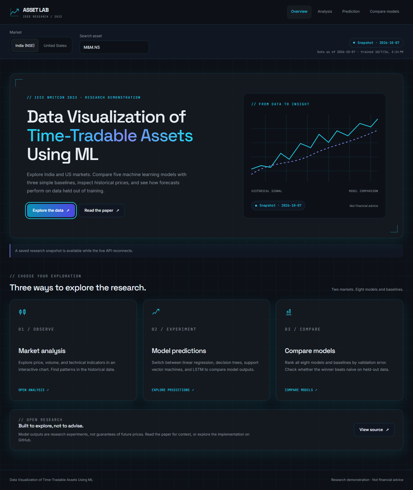
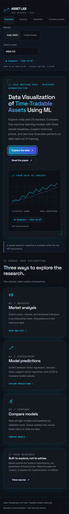
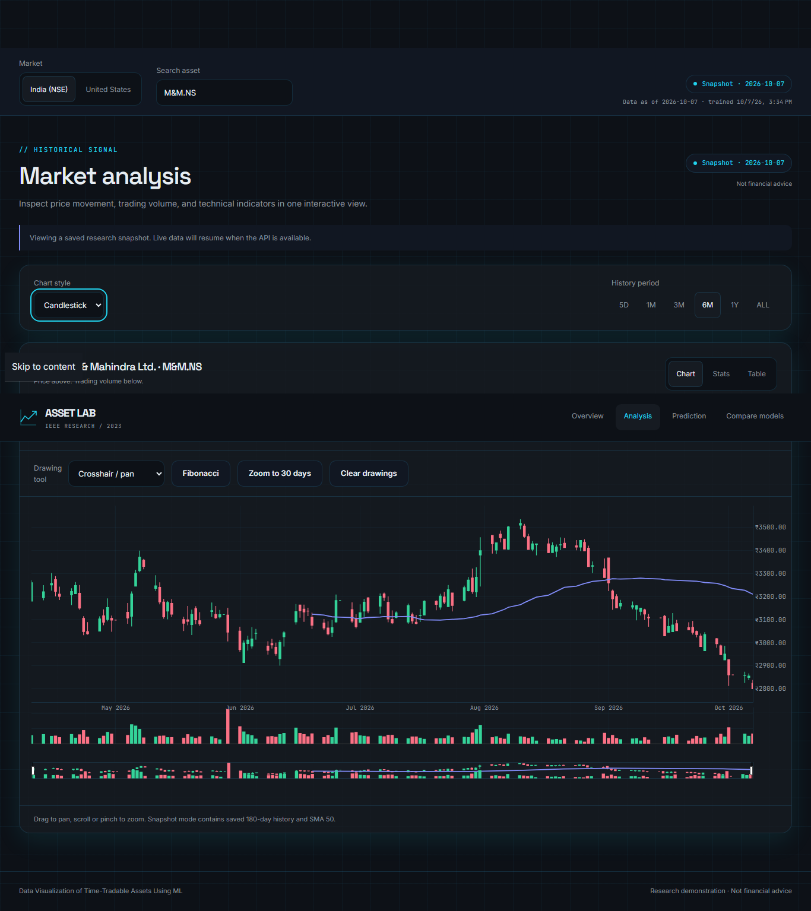
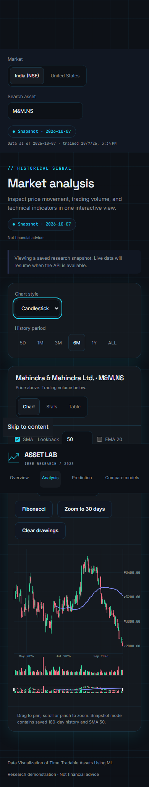
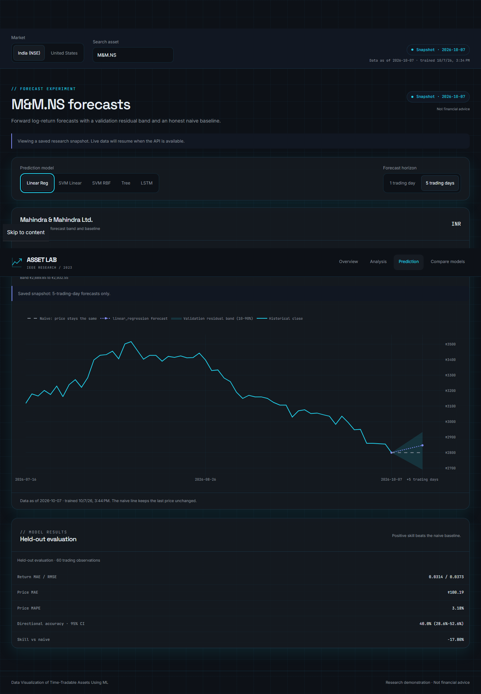
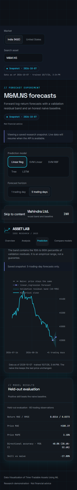
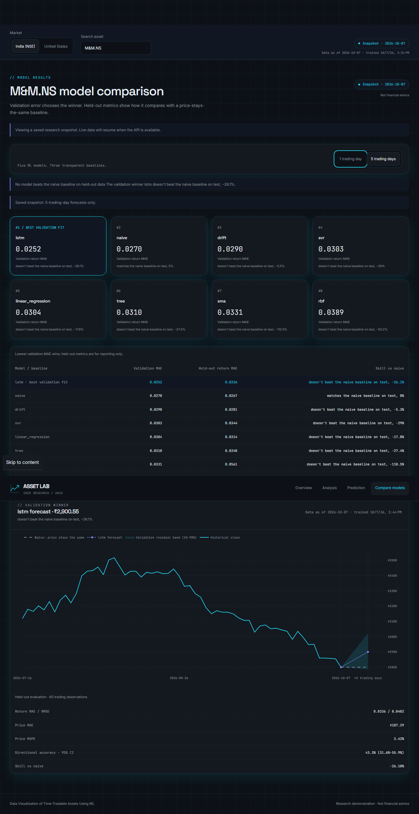
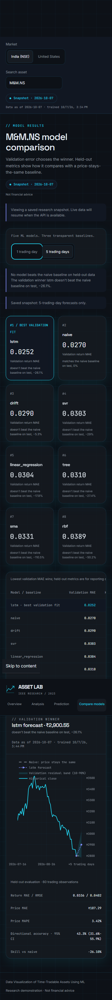

# Data Visualization of Time-Tradable Assets Using ML

An Angular 22 and FastAPI market-data terminal built around a 2023 IEEE student research publication, **“Data Visualisation of Time Tradable Assets Using Machine Learning.”** It lets a user inspect historical OHLCV data, overlay common technical indicators, and compare a small set of forecasting-model implementations.

This is a portfolio and learning project, **not investment advice, a trading system, or a validated price-prediction service**. The interface must not be presented as proof that a forecast is accurate or financially actionable.

## UI screenshots

Aurora UI from this PR's production build, shown with saved snapshot data. The live/snapshot badge identifies the data source; the design is the same in either mode.

| Page | Desktop (1366 px) | Mobile (390 px) |
| --- | --- | --- |
| Overview |  |  |
| Analysis |  |  |
| Prediction |  |  |
| Model comparison |  |  |

[Live demo](https://data-visualization-of-time-tradable-assets-using-ml.medhainnovation2026.workers.dev) · [Evaluation methodology](docs/EVALUATION.md) · [Deployment report](docs/V2_DEPLOYMENT_REPORT.md)

## What is implemented

- Angular 22 standalone Aurora frontend with signals, accessible searchable asset selection, India/US controls and native currencies.
- Lazy Plotly charts for OHLCV, volume, technical indicators, 1/5-day forecasts, empirical forecast bands and the naive baseline.
- Official Nifty 50 constituents plus the index (51 India assets), and seven US assets.
- Five ML models and three baselines, selected by expanding walk-forward validation MAE, with a separate held-out test set.
- Nightly deterministic CPU training writes atomic artifacts; API requests serve those artifacts without on-demand training.
- Honest test metrics and skill versus naive beside the validation winner. Directional accuracy is N/A for naive or zero-return forecasts.
- Static h=5 fallback covering all 58 assets, with Snapshot date badges when the live API is unavailable.
- Cloudflare Worker frontend and a hardened, resource-limited systemd API/training timer on medha-storage.

## Model boundary

Validation selects the winner; test metrics report its performance and never select it. A validation winner can perform worse than the naive baseline on test. The empirical residual band is not a guarantee, and these v2 results are not comparable to the paper's published results. See [EVALUATION.md](docs/EVALUATION.md) for splits, leakage checks, metrics and limitations.

## Architecture

```text
Browser -> Angular + lazy Plotly -> live FastAPI artifacts
                                -> static snapshot fallback
Nightly CPU training -> raw cache + atomic model artifacts
```

The permanent API is https://stock-api.medhainnovation.com/api. The frontend and backend deploy separately; the API's production CORS origin is restricted to the demo Worker.

## Local setup

### Backend

```bash
cd backend
python3 -m venv .venv
source .venv/bin/activate
pip install -r requirements.txt
uvicorn app.main:app --reload --port 8000
```

The API health endpoint is `http://localhost:8000/health`.

### Frontend

Set `frontend/src/environments/environment.ts` to the appropriate local API URL, then:

```bash
cd frontend
npm ci
npm start
```

For a production bundle:

```bash
npm run build
```

## API surface

| Endpoint | Purpose |
| --- | --- |
| `GET /health` | Process health response |
| `GET /api/markets` | Supported markets/currencies |
| `GET /api/companies/?market=in` or `?market=us` | Exact supported asset catalog |
| `GET /api/stocks/{ticker}/ohlcv?period=180d` | Cached historical OHLCV records |
| `GET /api/stocks/{ticker}/moving-average?period=180d` | OHLCV plus technical indicators |
| `GET /api/predictions/{ticker}/predict?model=linear_regression&horizon=1` | Cached 1/5-day forecast, band and held-out metrics |
| `GET /api/predictions/{ticker}/best-model?horizon=5` | Validation winner and leaderboard including baselines |
| `GET /api/models/status` | Training date, data dates and failures |

URL-encode ticker path segments, including `M&M.NS` as `M%26M.NS`. Local forecasting endpoints require trained artifacts; an untrained symbol returns 404 rather than training in the request.

## Repository layout

```text
frontend/                 Angular 22 application
backend/app/              FastAPI routes, services, schemas, and LSTM model
deploy/                   systemd, Nginx, tunnel, and deployment assets
```

## Limitations

Daily data can be delayed or include an incomplete latest bar. Forecasts exclude transaction costs and are research experiments, not trading advice. Static snapshots include h=5 only; fallback clearly switches to that saved horizon. Caches are process-local, while raw data and forecast artifacts persist on disk. Training and API resource limits protect the existing tunnel.

## Checks

```bash
npm ci --prefix frontend
npm run build --prefix frontend
node scripts/check_forecast_labels.cjs
node scripts/check_ticker_paths.cjs
node scripts/check_build_assets.cjs
```

The final check requires all 701 snapshot files in the deploy assets to match the verified fb2ff6a7 snapshot bytes. CI also runs backend leakage, sanity, metrics, deterministic training and artifact-serving tests. Browser screenshot and forecast-label checks are in `scripts/` and use external Playwright tooling.

## License

MIT; see [LICENSE](LICENSE). This does not make the project suitable for investment decisions.
